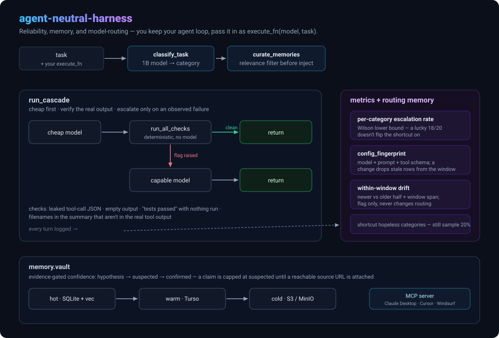

# Agent-Neutral Harness

[](https://github.com/munikumar-pulikanti/agent-neutral-harness/actions/workflows/ci.yml)
[](LICENSE)
[](pyproject.toml)

A reliability, memory, and model-routing harness for AI coding workflows that does
**not** own your agent loop.

Most agent frameworks make you adopt their runtime. This one is the opposite: you
keep your agent (LangGraph, a raw tool loop, an IDE assistant, whatever), and pass
it in as a plain `execute_fn(model, task) -> dict`. The harness handles the parts
that are the same everywhere — deciding when a cheap model is good enough, catching
a class of model failures deterministically, and sharing a memory vault across
tools over MCP.

Runs fully local by default (Ollama, CPU, no API key). Model names are always
parameters — nothing here hardcodes a model or a provider.



---

## Try it in 30 seconds

```bash
git clone https://github.com/munikumar-pulikanti/agent-neutral-harness
cd agent-neutral-harness
pip install -e .
python examples/quickstart.py
```

[`examples/quickstart.py`](examples/quickstart.py) needs no Ollama and no API key —
it fakes an `execute_fn`, classifies a task, runs the cheap tier, catches a
fabricated filename in the summary, and escalates. [`examples/`](examples/) has the
same flow against real Ollama and wrapped around a LangGraph agent.

---

## What's here

| Module | Purpose | Status |
|---|---|---|
| `cascade` | Run a cheap model, verify its **real** output, escalate to a capable model only on an **observed** failure. Learns per-category escalation rates and shortcuts hopeless categories (while still sampling them). | ✅ Working, tested |
| `reliability.assertions` | Deterministic checks on a response: leaked tool-call JSON, empty output, "tests passed" with nothing run, filenames in the summary that aren't in the real tool output. | ✅ Working, tested |
| `metrics` | Per-turn SQLite log (model, tokens, tier, escalation, flags) + eval baselines/results. | ✅ Working, tested |
| `routing.classifier` | Lightweight task-intent classifier (`investigate` / `implement` / `unit_tests` / `extract` / `general`). Ollama by default; inject any `generate_fn`. | ✅ Working, tested |
| `routing.curator` | Filter retrieved memories for *actual task relevance* before prompt injection, not just semantic similarity. | ✅ Working, tested |
| `fingerprint` | Combine model digest + system prompt + tool schema into one hash so an escalation-rate window is invalidated when any of them changes. | ✅ Working, tested |
| `memory.vault` | SQLite + FTS5 keyword search, optional ChromaDB semantic search, **evidence-gated confidence** (`hypothesis` → `suspected` → `confirmed`). A restated claim corroborates the existing memory instead of duplicating; without a verified evidence URL a memory is capped at `suspected`. Hot → warm → cold search cascade. | ✅ Working, tested |
| `memory.warm` (`[warm]`) | Push/pull sync with a shared libSQL/Turso replica. | ✅ Working (sync logic tested; live Turso not in CI) |
| `memory.cold` (`[cold]`) | Archive idle rows to an S3-compatible store (S3, MinIO, R2, B2); auto-restore on a search hit. | ✅ Working (tested with an in-memory store) |
| `memory.mcp_server` (`[mcp]`) | FastMCP server exposing the vault to any MCP client (Claude Desktop, Cursor, Windsurf, …). | ✅ Working |
| `evals.runner` | Re-run golden baselines through your agent, grade with an LLM judge, record pass/fail. | ✅ Working, tested |
| `dashboard` (`[dashboard]`) | Streamlit view of the metrics DB — routing, reliability flags, cost, eval pass rate. | ✅ Working |

---

## Install

```bash
pip install "agent-neutral-harness"              # core only (cascade + assertions + metrics + routing + fingerprint)
pip install "agent-neutral-harness[memory]"      # + semantic memory search (ChromaDB + local embeddings)
pip install "agent-neutral-harness[mcp]"         # + MCP server
pip install "agent-neutral-harness[warm]"        # + Turso warm tier
pip install "agent-neutral-harness[cold]"        # + object-store cold tier
pip install "agent-neutral-harness[dashboard]"   # + Streamlit dashboard
pip install "agent-neutral-harness[all]"         # everything
```

Local development:

```bash
uv sync --group dev --extra all
uv run pytest                     # fast suite
uv run pytest -m semantic         # + real ChromaDB tests (needs [memory])
uv run ruff check .
```

---

## Use it

### Cascade — cheap-first, verify, escalate on real failure

```python
from agent_neutral_harness import run_cascade

def execute_fn(model: str, task: str) -> dict:
    # YOUR agent runtime. Return the real result of running `task` on `model`.
    return {
        "final_content": "...",
        "tools_invoked": ["run_shell"],
        "tool_results": {"run_shell": "..."},
        "input_tokens": 1200, "output_tokens": 300,
        "error": None,
    }

answer = run_cascade(
    task="add a retry to the upload helper",
    category="implement",
    cheap_model="llama3.2:3b",
    capable_model="llama3.1:8b",
    execute_fn=execute_fn,
    config_fingerprint=fp,   # optional, see below
)
```

The cheap tier is only trusted if its output passes every deterministic check.
Escalation happens on **observed** failure, never a confidence guess. Once a
category's recent escalation rate clears 80% (min 20 samples), the cascade starts
skipping the cheap tier for it — but still samples it 20% of the time so it can
notice the cheap model getting better.

Two things keep that decision honest:

- It compares the threshold against the **Wilson score lower bound** of the rate,
  not the raw fraction — a lucky run of 18/20 doesn't flip the shortcut on.
- Pass a **`config_fingerprint`** (`fingerprint.config_fingerprint(model_digest=…,
  system_prompt=…, tools=…)`) and the escalation-rate history is scoped to it, so
  a model weight swap, a prompt edit, or a tool-schema change drops stale rows
  from the window instead of dragging the decision for ~50 turns.
  `metrics.detect_within_window_drift(category)` flags a behaviour change that
  leaves the fingerprint unchanged (e.g. a meaningful tool-description rewrite) —
  it splits the same turn-count window newer/older and reports the jump plus the
  wall-clock span it covers, so you can tell a real drift from a stale baseline.
  Flag only, never changes routing; surfaced per category in the dashboard, and
  `max_age_seconds=` bounds how far back the comparison reaches.

### Reliability checks standalone

```python
from agent_neutral_harness import run_all_checks

flags = run_all_checks(
    response_text=model_output,
    tools_invoked=["read_file"],
    tool_results={"read_file": actual_file_contents},
)
# [] means clean; e.g. ["fabricated_items_in_summary"] means the summary
# named a file that wasn't in the real tool output.
```

### Cross-tool memory over MCP

```bash
agent-neutral-memory          # runs the MCP server on stdio
```

Claude Desktop / Cursor / Windsurf MCP config:

```json
{
  "mcpServers": {
    "agent-neutral-memory": {
      "command": "agent-neutral-memory"
    }
  }
}
```

Tools exposed: `search_memory`, `search_memory_semantic`, `save_memory`,
`sync_embeddings`. A saved memory starts as `hypothesis`. A restated claim
corroborates the existing memory (bumping its count) instead of duplicating it;
`confirmed` needs 3+ corroborations **and** a verified, reachable `evidence_url`
(checked with an SSRF-guarded HTTP request). Without evidence a memory is capped
at `suspected` no matter how often it's restated.

### Warm & cold tiers

```python
from agent_neutral_harness.memory.vault import MemoryVault
from agent_neutral_harness.memory.warm import TursoWarmTier
from agent_neutral_harness.memory.cold import ObjectStoreColdTier

vault = MemoryVault()
vault.warm = TursoWarmTier(vault=vault, sync_url=..., auth_token=...)      # [warm]
vault.cold = ObjectStoreColdTier(bucket="my-cold", endpoint="http://localhost:9000",
                                 access_key="...", secret_key="...")       # [cold]

vault.warm.push(); vault.warm.pull()     # sync the shared replica
vault.cold.archive(vault, days=90)       # push idle rows to the object store
```

`vault.search_semantic()` then cascades hot → warm → cold, restoring anything it
finds in a colder tier back into hot.

Warm sync identifies rows by **content hash**, not local id, so two machines never
collide; a divergent edit of "the same" memory comes down through `save_memory`
and lands as `needs_review` rather than being silently merged.

### Dashboard

```bash
pip install "agent-neutral-harness[dashboard]"
agent-neutral-dashboard
```

---

## Configuration

| Env var | Default | Meaning |
|---|---|---|
| `AGENT_NEUTRAL_HARNESS_HOME` | `~/.agent-neutral-harness` | Base dir for state |
| `AGENT_NEUTRAL_HARNESS_METRICS_DB` | `<home>/metrics.db` | Metrics DB path |
| `AI_MEMORY_VAULT_DIR` | `~/.ai-memory-vault` | Memory vault dir (SQLite + Chroma) |
| `AGENT_NEUTRAL_HARNESS_LOG` | `INFO` | Log level for the MCP server |
| `TURSO_DATABASE_URL` / `TURSO_AUTH_TOKEN` | — | Warm-tier credentials (if not passed explicitly) |

---

## License

MIT — see [LICENSE](LICENSE).
